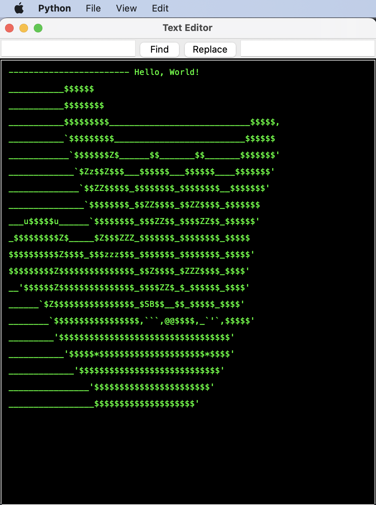
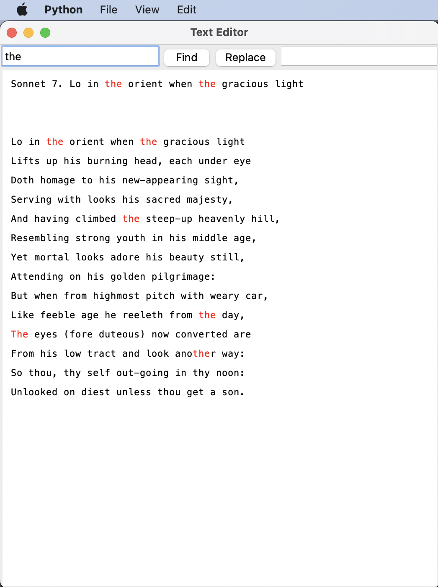
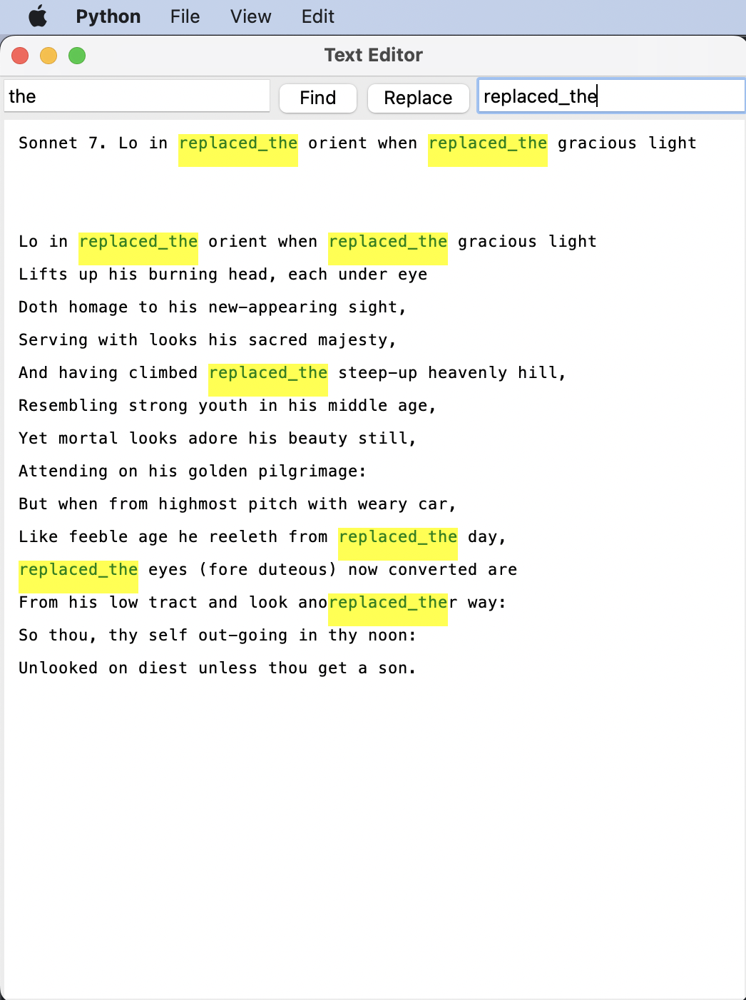
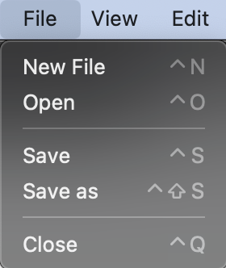
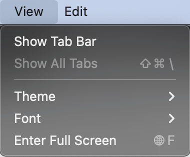
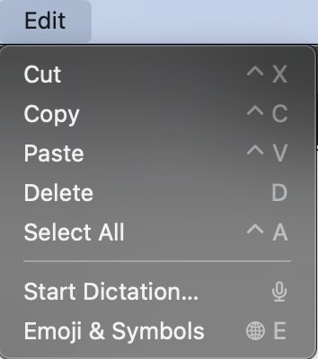

<h1 id="text-editor">Text Editor</h1>
<blockquote>

Консольный текстовый редактор - самостоятельная компьютерная программа, предназначенная для создания и изменения текстовых данных в общем и текстовых файлов, в частности.

Консольный текстовой редактор предназначен для работы с текстовыми файлами в интерактивном режиме. Он позволяет просматривать содержимое текстовых файлов и производить над ними различные действия: вставку, удаление и копирование текста.

</blockquote>

<h1 id="-arncpp">Базовый Функционал:</h1>

* Возможность редактирования файла
* Перемещение по тексту при помощи “стрелок” - по словам, в начало/конец строки. 
* Удаление строк и слов
* Текстовый поиск и замена
* Хоткеи для сохранения и выхода
    
<h2 id="-pycharm">Как запустить текстовый редактор через консоль</h2>

<strong>Первый этап: установка python.
<h5 id="-python3"><em>Если у вас уже установлен python3 - пропустите этот этап</em></h5></strong>

<strong>1. Скачайте python3 с официального <a href="https://www.python.org/downloads/">сайта</a> и установите его.</strong>
<strong>2. Во время установки <em>обязательно</em> поставьте галочку &quot;Add Python 3.x to PATH&quot;.</strong>

<strong>3. Когда установка закончится запустите консоль.</strong>

<strong>Второй этап: скачивание и запуска проекта.</strong>

<strong>1. Скачайте проект с github любым удобным для вас способом.</strong>

<strong>2. В консоли перейдите в папку. </strong>

<strong>3. Запустите текстовый редактор.</strong>

<strong>4. Наслаждайтесь!</strong>

Команды, которые нужно выполнить, для запуска через консоль:

<code>git clone git@github.com:khusrabov/TextEditor.git</code>

<code>cd</code>

<code>python TextEditor.py</code>

<h2 id="-pycharm">Как запустить текстовый редактор на PyCharm</h2>

<strong>1. Создайте пустой проект на PyCharm: (<em>File -&gt; New Project</em>)</strong>

<strong>2. Зайдите в убунту-консоль, перейдите в папку с проектом (с помощью cd)</strong>

<strong>3. Скачайте проект с github любым удобным для вас способом. </strong>

<strong>4. Подождите, пока скачается. После скачивания откройте проект в PyCharm.</strong>

<strong>5. Запустите файл TextEditor.py</strong>

<strong>6. Запустив текстовый редактор введите свои первые слова!</strong>

<h1 id="-">Скрины использования функционала и примеры работы биндов:</h1>

* Интерфейс:
    
 Вас встречает текстовый редактор с черным фоном и зеленным цветом шрифта, три меню: File, View, Edit, 
    о которых более подробно будет написано чуть позже, а также две кнопки Find & Replace,
    с рамкой ввода для каждой кнопки текста.

* Работа с кнопками Find & Replace:
 
 Давайте найдем все повторения "the" в 7 сонате Шекспира.

 Теперь поменяем на "replaced_the".

* File, View, Edit:

В приложение также забинжены множество команд. 
Сочетания клавиш указаны справа от всех действий. Но вот полный список:
* File Menu:
  
  * Control-n = new_file
  * Control-o = open_file
  * Control-s = save_file
  * Control-Shift-s = save_file_as
  * Control-q = close_file

* Edit Menu:
  * Control-x = cut
  * Control-c = copy
  * Control-v = paste
  * Control-d = delete
  * Control-a = select all

* Text bind:

  * Left (<-)  
  * Right (->)
  * Up (/\)
  * Down (\/)
  * Control-Shift-Left = move_to_start
  * Control-Shift-Right = move_to_end
  * Control-w = move_to_start_of_line
  * Control-e = move_to_end_of_line
  * Control-Right = move_cursor_forward
  * Control-Left = move_cursor_backward
